# 8mb.local – Video Compressor

> [!CAUTION]
> **IMPORTANT DISCLAIMER:** This software is provided "as is" without warranty of any kind.
>
> This is a heavily modified fork of https://github.com/JMS1717/8mb.local
>
> Whilst hardware support has been kept the same, with native ARM64 and MacOS support built up, outside of this scope, it has not been tested directly with Nvidia/AMD/Intel
> Support will not be provided, as it has been purpose built to run in a Container with a native Dameon in MacOS for Hardware Accel.

8mb.local is a self-hosted, fire-and-forget video compressor. Drop a file, choose a target size (e.g., 8 MB, 25 MB, 50 MB, 100 MB), and let GPU-accelerated encoding produce compact outputs with AV1/HEVC/H.264. Supports **NVIDIA NVENC** hardware encoding, Apple **VideoToolbox**, and automatic **CPU fallback**. 

---

<details>
<summary>✨ <b>Features</b></summary>

<br>

- **NVIDIA NVENC hardware encoding** natively supported via Container Toolkit
- **Native macOS VideoToolbox hardware encoding** via a transparent host daemon running securely via `launchd` for Apple M-series chips
- **Two-Mode Interface**: A streamlined Simple Mode and an advanced Sidebar Mode
- **Smart Quality Profiles** (`Fast`, `Balanced`, `Quality`, `Best`) with a **Perfect Quality Override** function
- **Robust encoder validation** at startup — tests actual encoder initialization, not just availability
- **AV1, HEVC (H.265), and H.264** encoding natively and via deep ARM container optimizations (`-DNATIVE=ON`), including `libsvtav1` and `libaom-av1`
- **Ultra-lightweight Frontend**: Native CSS SvelteKit implementation yielding instantaneous Node compilation.
- **Batch processing** — compress multiple files in a single operation
- **Job history** and **Auto-download** workflows included

</details>

<details>
<summary><b>📸 Screenshots</b></summary>
<br>

| | | |
| :---: | :---: | :---: |
| 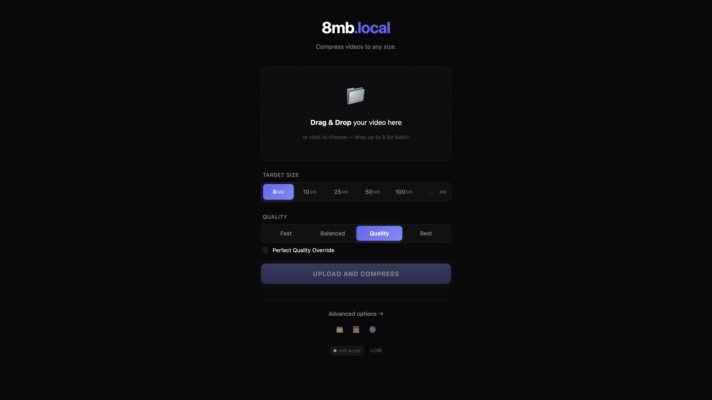<br>Home | 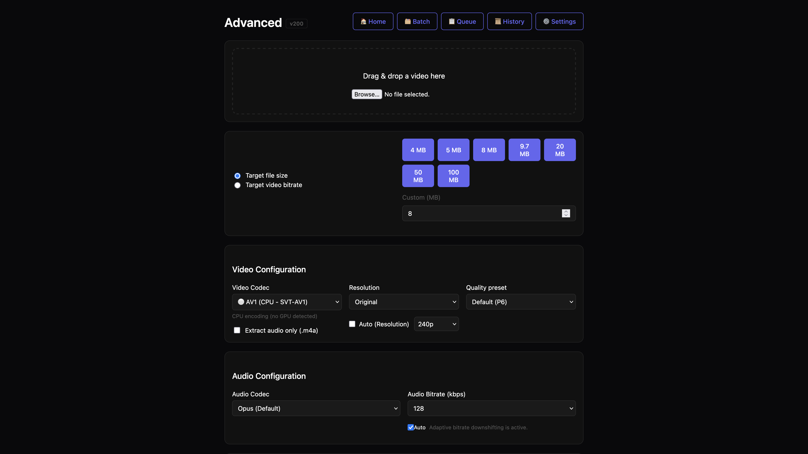<br>Advanced | 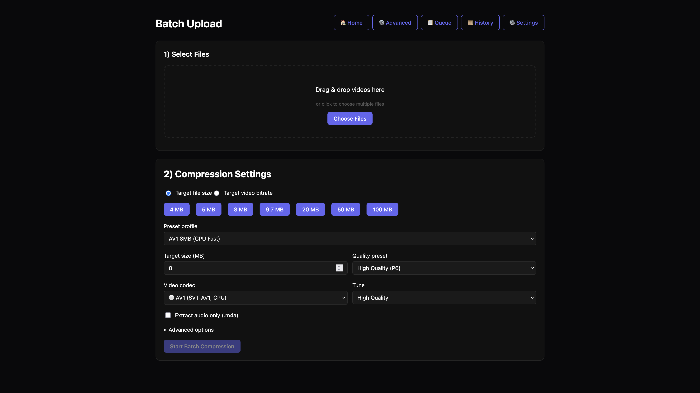<br>Batch |
| 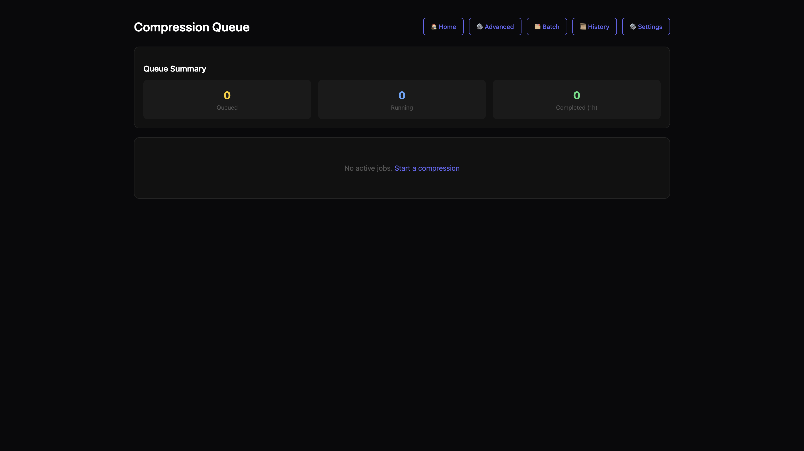<br>Queue | 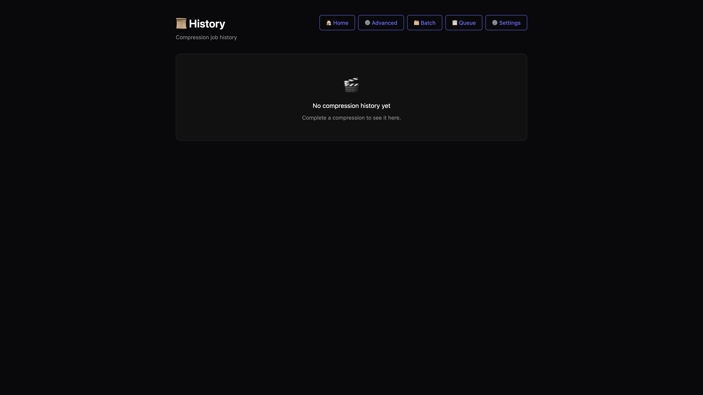<br>History | 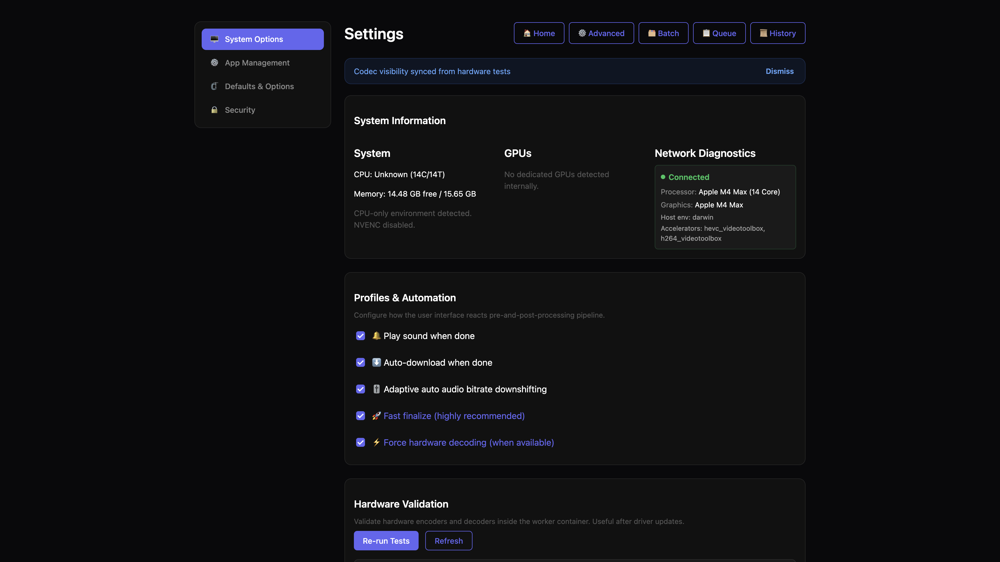<br>Settings - System Options |
| 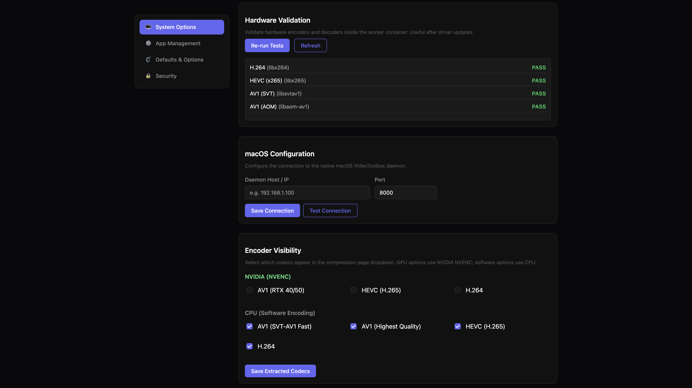<br>Settings - System Options | 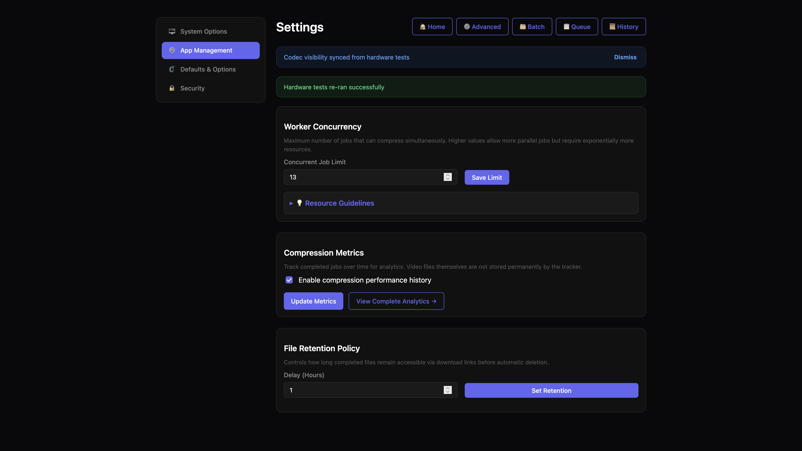<br>Settings - App Management | 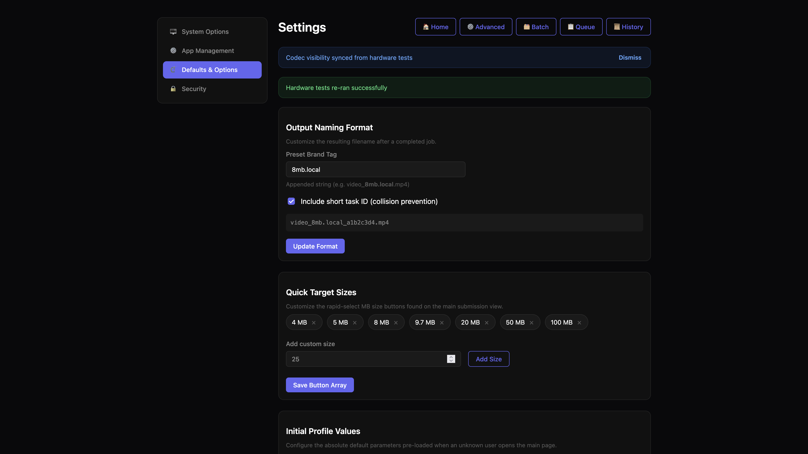<br>Settings - Defaults & Options |
| 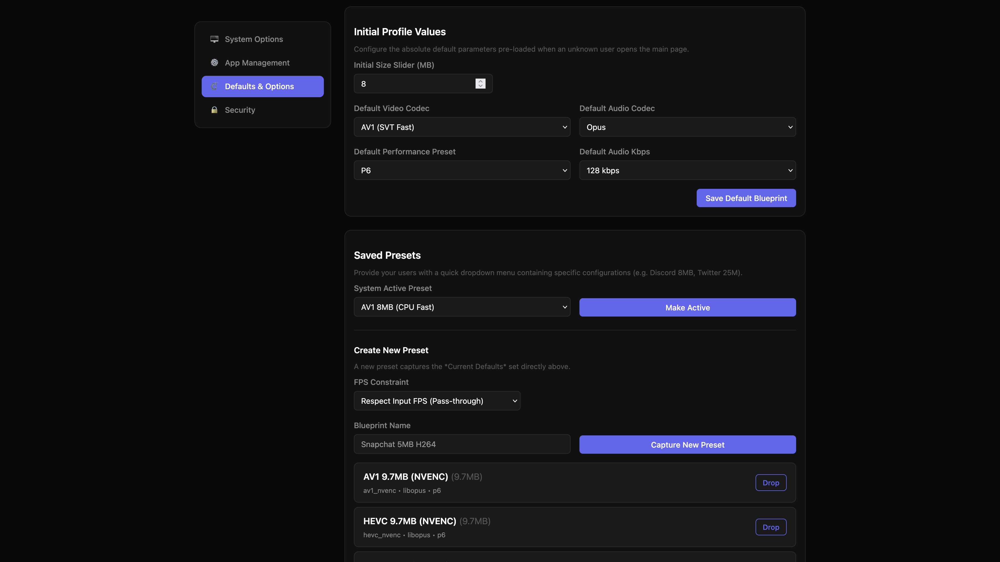<br>Settings - Defaults & Options | 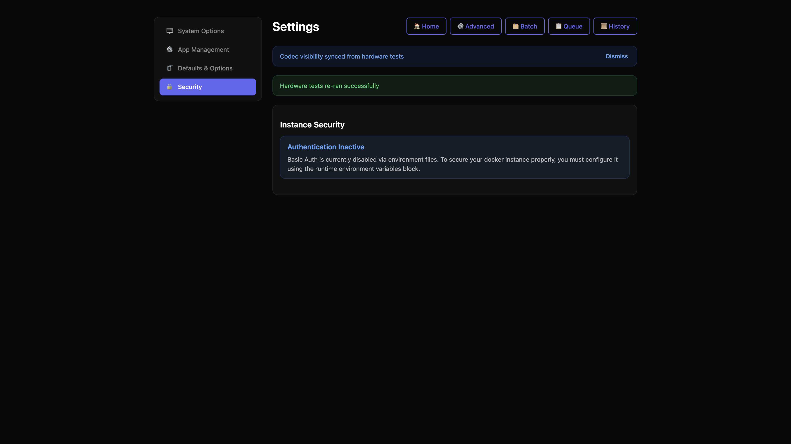<br>Settings - Security | <br>API |

</details>

<details open>
<summary>🚀 <b>Installation Guides</b></summary>

<br>

### Default (NVIDIA GPU)

Requires [NVIDIA Container Toolkit](https://docs.nvidia.com/datacenter/cloud-native/container-toolkit/install-guide.html) and a working `docker run --rm --gpus all nvidia/cuda:12.2.0-base-ubuntu22.04 nvidia-smi` on the host.

```bash
docker run -d \
  --name 8mb.local \
  --gpus all \
  -e NVIDIA_DRIVER_CAPABILITIES=compute,video,utility \
  -p 8001:8001 \
  -v ./uploads:/app/uploads \
  -v ./outputs:/app/outputs \
  xesurient/8mb.local:latest
```

### macOS Hardware Acceleration (M-Series)

Docker on macOS runs inside a Linux VM and fundamentally lacks access to Apple Silicon hardware encoders. 8mb.local ships with a native, zero-copy macOS daemon that intercepts encode requests using standard macOS `launchctl` bounds:

1. Bring up your stack using the CPU-only compose file:
   `docker compose -f docker-compose.cpu.yml up -d --build`
2. Install the native daemon on your host Mac:
   ```bash
   cd daemon
   bash install.sh
   ```
   or
   ```bash
   ./daemon/install.sh
   ```

The daemon runs natively on macOS. The Docker container will automatically bridge with your M-series hardware yielding huge encoding performance boosts. 

**Note**: You can manually customize your VideoToolbox connection logic natively inside the `8mb.local` instance Settings UI if you choose to bind your daemon to a custom port.

### CPU Only (No GPU)

```bash
docker run -d \
  --name 8mb.local \
  -p 8001:8001 \
  -v ./uploads:/app/uploads \
  -v ./outputs:/app/outputs \
  xesurient/8mb.local:latest
```

Access the web UI at **http://localhost:8001**.
If building from source, simply clone the repository and run `docker compose up -d --build`. Use `docker-compose.cpu.yml` for CPU-only nodes.

</details>

<details>
<summary>💻 <b>Automation & Headless API</b></summary>

<br>

8mb.local maintains an entirely distinct backend logic schema parsed natively through **FastAPI**. The web UX is completely optional. 

FastAPI automatically generates an interactive swagger interface to test payloads. Assuming 8mb.local is active, simply navigate your web browser to **`http://localhost:8001/docs`** to view and construct valid curl configurations.

For shell-script automation and headless workflow structures, review the **[API Reference Guide](docs/API_REFERENCE.md)**.

</details>

<details>
<summary>📝 <b>Credits</b></summary>

<br>

8mb.local utilizes elements from the broader open-source community. Special thanks to FFmpeg for the incredibly powerful encoding logic powering the backend, and to the Svelte framework for rendering the frontend footprint at a fraction of the cost of heavy JS frameworks. 

UI assets and components were modeled and sourced using open design palettes, adopting clean native CSS practices for maximum speed. The initial homepage architecture is a fork and rebase of the beautiful [fits.video](https://fits.video/) project created by their open-source [GitHub team](https://github.com/fits-video), tweaked and structurally unified to cleanly serve the 8mb.local compressor workflow.

</details>

<details>
<summary>📚 <b>Advanced Documentation</b></summary>

<br>

Need to configure something deep inside the stack? We've abstracted advanced operations out into targeted guides.

- ⚙️ **[Configuration & Environment Limits](docs/CONFIGURATION.md)**
- ⚡ **[Architecture & Concurrency Tuning](docs/ARCHITECTURE.md)**
- 🛡️ **[Reverse Proxy SSE Routing (NGINX/Traefik)](docs/REVERSE_PROXY.md)**
- 🖥️ **[Supported Hardware Processors](docs/GPU_SUPPORT.md)**
- 📜 **[Internal Task Queue System](docs/QUEUE_SYSTEM.md)**

</details>
