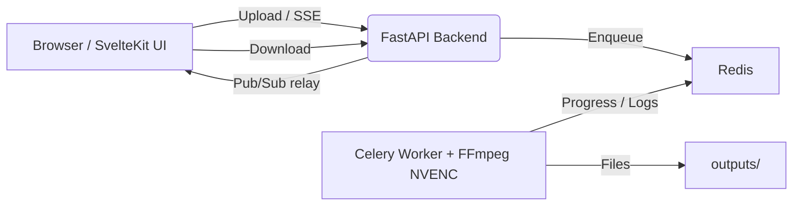

# 8mb.local – Self-Hosted GPU Video Compressor

8mb.local is a self-hosted, fire-and-forget video compressor. Drop a file, choose a target size (e.g., 8 MB, 25 MB, 50 MB, 100 MB), and let GPU-accelerated encoding produce compact outputs with AV1/HEVC/H.264. Supports **NVIDIA NVENC** hardware encoding with automatic **CPU fallback**. The stack includes a SvelteKit UI, FastAPI backend, Celery worker, Redis broker, and real-time progress via Server-Sent Events (SSE).

<p align="center">
  <a href="https://www.youtube.com/watch?v=1YDjDtZ21lc">
    
  </a>
  <br/>
  <b>Video Demo</b>
</p>

## Table of Contents

- [Features](#features)
- [Screenshots](#screenshots)
- [Projects](#projects)
- [Architecture](#architecture)
- [Installation](#installation)
- [Usage](#usage)
- [Configuration](#configuration)
- [Performance & Concurrency](#performance--concurrency)
- [Reverse Proxy Configuration](#reverse-proxy-configuration)
- [Troubleshooting](#troubleshooting)
- [License](#license)

## Features

- **NVIDIA NVENC hardware encoding** with automatic CPU fallback when no GPU is available
- **Robust encoder validation** at startup — tests actual encoder initialization, not just availability
- **AV1, HEVC (H.265), and H.264** encoding via NVENC or CPU software encoders
- Drag-and-drop UI with helpful presets and advanced options (codec, container, tune, audio bitrate)
- **Configurable codec visibility** — enable/disable specific codecs in the Settings page
- **Resolution control** — set max width/height while maintaining aspect ratio
- **Video trimming** — specify start/end times (seconds or HH:MM:SS format)
- **Real-time progress tracking** using output size, time processed, bitrate, and wall-clock estimates
- **Real-time FFmpeg logs** streamed during compression
- **Live queue management** — view all active jobs with real-time progress, cancel individual jobs, or clear entire queue
- **Automatic file size optimization** — re-encodes with adjusted bitrate if output exceeds target by >2%
- **Batch processing** — compress multiple files in a single operation
- **Job history** enabled by default
- **Auto-download** enabled by default
- Output container choice: MP4 or MKV, with compatibility safeguards
- **Version tracking** — UI displays current version, backend provides `/api/version`

## Screenshots

<table>
  <tr>
    <td align="center">
      <b>Main Interface</b><br/>
      
    </td>
    <td align="center">
      <b>GPU Support List</b><br/>
      
    </td>
    <td align="center">
      <b>Settings Panel</b><br/>
      
    </td>
  </tr>
  <tr valign="top">
    <td align="center">
      <b>Live Queue</b><br/>
      
    </td>
    <td align="center">
      <b>Compressing (Real-time Logs)</b><br/>
      
    </td>
    <td align="center">
      <b>Encoder Validation Tests</b><br/>
      
    </td>
  </tr>
  <tr valign="top">
    <td align="center">
      <b>Job History</b><br/>
      
    </td>
    <td align="center">
      <b>Advanced Options</b><br/>
      
    </td>
    <td></td>
  </tr>
</table>

## Projects

Public instances run by people who offer their **8mb.local** install for anyone to use (community compressors, demos, mirrors). If you run a public deployment and want it listed here, open a pull request that adds a row to this section.

| Site | Notes |
|------|--------|
| [fits.video](https://fits.video/) | Online compressor (free and open source) |

## Architecture



**Components**

| Layer | Technology | Role |
|-------|-----------|------|
| Frontend | SvelteKit + Vite | Drag-and-drop UI, size estimates, SSE progress/logs, download |
| Backend API | FastAPI | Accepts uploads, runs ffprobe, relays SSE, serves downloads |
| Worker | Celery + FFmpeg 6.1.1 | Compression with NVENC or CPU; parses `ffmpeg -progress` |
| Broker | Redis | Celery broker and pub/sub transport for progress events |

**Data & files**
- `uploads/` — incoming files (cleaned up after `FILE_RETENTION_HOURS`)
- `outputs/` — compressed results (cleaned up on the same schedule)

All components run in a single container via supervisord.

## Installation

### Quick Start (Docker Hub)

#### NVIDIA GPU

```bash
docker run -d \
  --name 8mblocal \
  --gpus all \
  -e NVIDIA_DRIVER_CAPABILITIES=compute,video,utility \
  -p 8001:8001 \
  -v ./uploads:/app/uploads \
  -v ./outputs:/app/outputs \
  jms1717/8mblocal:latest
```

> The `-e NVIDIA_DRIVER_CAPABILITIES=compute,video,utility` flag is **required** — it tells the NVIDIA Container Toolkit to mount NVENC libraries into the container.

#### CPU Only (No GPU)

```bash
docker run -d \
  --name 8mblocal \
  -p 8001:8001 \
  -v ./uploads:/app/uploads \
  -v ./outputs:/app/outputs \
  jms1717/8mblocal:latest
```

Access the web UI at **http://localhost:8001**.

### Docker Compose

#### NVIDIA GPU

```yaml
services:
  8mblocal:
    image: jms1717/8mblocal:latest
    container_name: 8mblocal
    ports:
      - "8001:8001"
    volumes:
      - ./uploads:/app/uploads
      - ./outputs:/app/outputs
      - ./.env:/app/.env  # optional
    gpus: all
    environment:
      - NVIDIA_DRIVER_CAPABILITIES=compute,video,utility
    restart: unless-stopped
```

#### CPU Only

```yaml
services:
  8mblocal:
    image: jms1717/8mblocal:latest
    container_name: 8mblocal
    ports:
      - "8001:8001"
    volumes:
      - ./uploads:/app/uploads
      - ./outputs:/app/outputs
      - ./.env:/app/.env  # optional
    restart: unless-stopped
```

Then run:

```bash
docker compose up -d
```

### Building from Source

**Default (NVIDIA GPU):** requires [NVIDIA Container Toolkit](https://docs.nvidia.com/datacenter/cloud-native/container-toolkit/install-guide.html) and a working `docker run --rm --gpus all nvidia/cuda:12.2.0-base-ubuntu22.04 nvidia-smi` on the host.

```bash
git clone https://github.com/JMS1717/8mb.local.git
cd 8mb.local
docker compose up -d --build
```

**CPU only** (no GPU passthrough — e.g. macOS or machine without NVIDIA toolkit):

```bash
docker compose -f docker-compose.cpu.yml up -d --build
```

### Platform Notes

| Platform | GPU Support | Notes |
|----------|------------|-------|
| **Windows** | NVIDIA via WSL2 | Install Docker Desktop, enable WSL2 GPU support, install NVIDIA drivers |
| **Linux** | NVIDIA native | Install NVIDIA drivers + [Container Toolkit](https://docs.nvidia.com/datacenter/cloud-native/container-toolkit/install-guide.html) |
| **macOS** | CPU only | Docker runs in a Linux VM without GPU passthrough |

### Verify Installation

```bash
# Check container status
docker ps | grep 8mblocal

# Check NVIDIA GPU access
docker exec 8mblocal nvidia-smi

# List available encoders
docker exec 8mblocal bash -c "ffmpeg -hide_banner -encoders | grep -E 'nvenc|264|265|av1'"

# View startup logs
docker logs 8mblocal
```

### Update to Latest Version

```bash
docker compose pull
docker compose up -d
```

Or with `docker run`:

```bash
docker pull jms1717/8mblocal:latest
docker stop 8mblocal && docker rm 8mblocal
# Re-run your docker run command
```

## Usage

1. **Drop a video** — drag and drop or click Choose File. Analysis runs automatically.
2. **Pick a target size** — click a preset button or enter a custom MB value.
3. **Optional: open Advanced Options**
   - **Video Codec**: AV1 (best quality, RTX 40/50), HEVC (H.265), or H.264 (widest compatibility)
   - **Audio Codec**: Opus (default) or AAC — MP4 containers auto-switch to AAC
   - **Speed/Quality**: NVENC presets P1 (fastest) through P7 (best quality), default P6
   - **Container**: MP4 (most compatible) or MKV (best with Opus audio)
   - **Tune**: HQ (default), Low Latency, Ultra-Low Latency, or Lossless
   - **Resolution**: Set max width/height to downscale while preserving aspect ratio
   - **Trimming**: Set start/end times to compress only a portion
4. **Click Compress** and watch progress/logs in real time. Cancel anytime. Download starts automatically.

**Tips**
- For very small targets, prefer AV1 or HEVC and keep audio around 96–128 kbps.
- For speed, try Low Latency tune with a faster preset (P1–P4).
- MP4 + Opus is not supported; the worker auto-switches to AAC for MP4 containers.
- MP4 outputs include `+faststart` for better web/streaming playback.

## Configuration

### Environment Variables

Create a `.env` file and mount it at `/app/.env`:

```env
# Authentication (also configurable via Settings UI)
AUTH_ENABLED=false
AUTH_USER=admin
AUTH_PASS=changeme

# File retention
FILE_RETENTION_HOURS=1

# Worker concurrency (max parallel jobs)
WORKER_CONCURRENCY=4

# Codec visibility (all default to true)
CODEC_H264_NVENC=true
CODEC_HEVC_NVENC=true
CODEC_AV1_NVENC=true
CODEC_LIBX264=true
CODEC_LIBX265=true
CODEC_LIBAOM_AV1=true

# Redis / backend (usually no need to change)
REDIS_URL=redis://127.0.0.1:6379/0
BACKEND_HOST=0.0.0.0
BACKEND_PORT=8001
```

### Settings UI

Manage settings at `/settings` with no container restart required:

- **Authentication** — enable/disable, manage credentials
- **Default Presets** — target size, codec, quality, container defaults
- **Codec Visibility** — enable/disable NVIDIA and CPU codecs
- **Preset Profiles** — create named presets for quick access
- **Worker Concurrency** — adjust parallel job limit
- **Size Buttons** — customize the target size quick-pick buttons
- **GPU Support Reference** — hardware encoding compatibility at `/gpu-support`

## Performance & Concurrency

8mb.local supports multiple parallel compression jobs. Configure via Settings UI or `WORKER_CONCURRENCY` env var.

| GPU | Recommended Concurrency | Notes |
|-----|------------------------|-------|
| RTX 5090 / 5080 / 5070 Ti | 8–12 jobs | 9th gen NVENC (x2), top tier |
| RTX 4090 / 4080 / 4070 Ti | 8–12 jobs | 8th gen NVENC, excellent throughput |
| RTX 3090 / 3080 / 3070 | 6–10 jobs | 7th gen NVENC (no AV1) |
| RTX 2080 Ti / 2070 / 2060 | 3–5 jobs | 6th gen NVENC |
| GTX 1660 / 1650 | 2–4 jobs | Entry-level NVENC |
| CPU only | 1–2 per 4 cores | High CPU usage, much slower |

**Considerations**
- Most consumer NVIDIA GPUs support 2–3 native NVENC sessions; driver patches or Pro GPUs allow more.
- Each job uses ~200–500 MB RAM and ~100–200 MB VRAM.
- SSD recommended for 6+ concurrent jobs (disk I/O becomes a bottleneck).
- Monitor GPU temps — sustained load above 80 °C may cause throttling.
- Start with 4 concurrent jobs and increase while monitoring utilization.

> **Container restart required** after changing worker concurrency.

## Reverse Proxy Configuration

SSE (Server-Sent Events) requires special proxy configuration to prevent buffering.

### Nginx / Nginx Proxy Manager

```nginx
location /api/stream/ {
    proxy_pass http://backend:8001;
    proxy_buffering off;
    proxy_cache off;
    proxy_set_header Connection '';
    chunked_transfer_encoding on;
}
```

In **Nginx Proxy Manager**: Edit Proxy Host → Advanced tab → Custom Nginx Configuration.

### Traefik

```yaml
labels:
  - "traefik.http.middlewares.no-buffer.buffering.maxRequestBodyBytes=0"
  - "traefik.http.middlewares.no-buffer.buffering.maxResponseBodyBytes=0"
  - "traefik.http.routers.8mblocal.middlewares=no-buffer"
```

### Apache

```apache
<Location /api/stream/>
    ProxyPass http://backend:8001/api/stream/
    ProxyPassReverse http://backend:8001/api/stream/
    SetEnv proxy-sendchunked 1
    SetEnv proxy-interim-response RFC
</Location>
```

**Why this matters**: Without `proxy_buffering off`, your proxy buffers the entire SSE stream and delivers all progress events at once when the job completes — progress appears stuck at 0% until done.

## Troubleshooting

### Container won't start with `--gpus all`

If the host has no NVIDIA GPU, Docker's NVIDIA runtime hook will abort:

```
nvidia-container-cli: initialization error: WSL environment detected but no adapters were found
```

**Fix**: Remove `--gpus all` and any `NVIDIA_*` environment variables. The app will start in CPU mode automatically.

### NVENC not working

**1. Missing NVIDIA_DRIVER_CAPABILITIES**

Symptom: `Cannot load libnvidia-encode.so.1`

Fix: Add the environment variable to your docker run or compose:

```bash
-e NVIDIA_DRIVER_CAPABILITIES=compute,video,utility
```

This tells the Container Toolkit to mount NVENC libraries into the container.

**2. Driver too old (NVENC API mismatch)**

Symptom: `Driver does not support the required nvenc API version. Required: 13.0 Found: 12.1`

This means your NVIDIA driver is 535.x or older. You need driver 550+.

```bash
# Debian 12
wget https://developer.download.nvidia.com/compute/cuda/repos/debian12/x86_64/cuda-keyring_1.1-1_all.deb
sudo dpkg -i cuda-keyring_1.1-1_all.deb
sudo apt update && sudo apt install nvidia-driver
sudo reboot

# Ubuntu
sudo add-apt-repository ppa:graphics-drivers/ppa
sudo apt update && sudo apt install nvidia-driver-550
sudo reboot
```

Verify after reboot: `nvidia-smi` should show driver 550+.

**3. Missing NVIDIA Container Toolkit**

```bash
# Install (Debian/Ubuntu)
curl -fsSL https://nvidia.github.io/libnvidia-container/gpgkey \
  | sudo gpg --dearmor -o /usr/share/keyrings/nvidia-container-toolkit-keyring.gpg
distribution=$(. /etc/os-release; echo $ID$VERSION_ID)
curl -s -L https://nvidia.github.io/libnvidia-container/$distribution/libnvidia-container.list \
  | sed 's#deb https://#deb [signed-by=/usr/share/keyrings/nvidia-container-toolkit-keyring.gpg] https://#g' \
  | sudo tee /etc/apt/sources.list.d/nvidia-container-toolkit.list
sudo apt-get update && sudo apt-get install -y nvidia-container-toolkit
sudo systemctl restart docker
```

**If you can't upgrade the driver**, the system will automatically fall back to CPU encoding. Your videos will still compress — just slower.

### Progress bar stuck at 0%

**Cause**: Reverse proxy buffering SSE responses.

**Fix**: Add `proxy_buffering off;` for the `/api/stream/` location. See [Reverse Proxy Configuration](#reverse-proxy-configuration).

### File slightly over target size

This is handled automatically. If the output exceeds the target by more than 2%, the system re-encodes with a reduced bitrate (up to 2 retries). You'll see a notification and hear an audio alert.

### General issues

| Problem | Solution |
|---------|----------|
| Permission denied on uploads/outputs | `chmod 777 uploads outputs` or `chown $USER:$USER uploads outputs` |
| Port already in use | Change mapping: `-p 8080:8001` |
| Container won't start | `docker logs 8mblocal` to check errors; `docker rm -f 8mblocal` and retry |
| FFmpeg errors | Check logs in the UI; try CPU-only codecs (libx264/libx265/libaom-av1) |

### Quick Diagnostic Commands

```bash
docker ps | grep 8mblocal              # Is it running?
docker logs 8mblocal                   # Startup and runtime logs
docker exec 8mblocal nvidia-smi        # GPU visible?
docker exec 8mblocal ffmpeg -hide_banner -encoders 2>&1 | grep nvenc  # NVENC available?
docker restart 8mblocal                # Restart
docker logs -f 8mblocal               # Live log tail
```

## License

Creative Commons Attribution-NonCommercial 4.0 International (CC BY-NC 4.0)

You are free to use, share, and adapt this project for non-commercial purposes with appropriate attribution. Commercial use requires a separate license — please contact me directly.

## Contributing

Pull requests welcome! Please ensure Docker builds succeed and test with your GPU hardware.

## Support

For issues, questions, or feature requests, please open an issue on GitHub.
